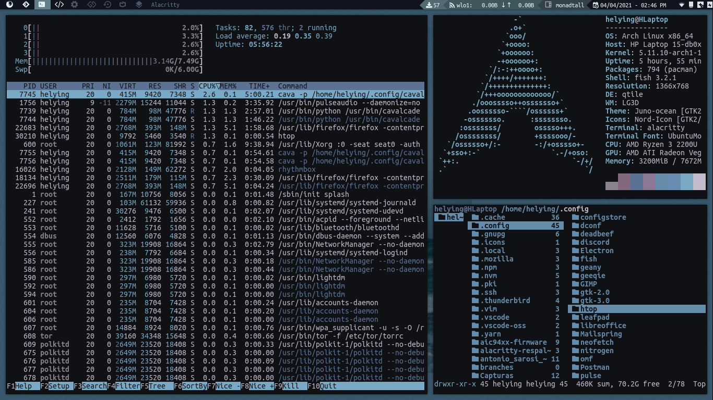

# Dotfiles-Helying-Vallejos
Mis Dotfiles y personalizacion de Arch Linux



***Indice***
- [Requisitos](#requisitos)
- [Repositorio](#repositorio)
- [Comandos de Git](#comandos-de-git)
    - [Usar git desde la terminal](#usar-git-desde-la-terminal)
- [GNU stow para sincronizar dotfiles](#gnu-stow-para-sincronizar-dotfiles)
    - [Respaldar directorios locales en git](#repaldar-directorios-locales-en-git)
    - [Restaurar los dotfiles en una nueva maquina](#restaurar-los-dotfiles-en-una-nueva-maquina)


    


## Requistos

Instala git para los comandos en la terminal
```bash
# Arch linux
sudo pacman -S git
```

## Repositorio

1. Clona el repositorio a nueva carpeta ~/.dotfiles
```zsh
# HTTPS
git clone https://github.com/Li7ewire/Dotfiles-Helying-Vallejos.git ~/.dotfiles
 
# SSH
git clone git@github.com:Li7ewire/Dotfiles-Helying-Vallejos.git ~/.dotfiles
```

# Comandos de git

## Usar git desde la terminal

1. Agregar un nuevo archivo local a github

``` zsh
# Para enviar un nuevo archivo especifico
git add "nombre_del_archivo"

# Para actualizar todos los archivos en github
git add -u 

# Para enviar y actualizar todos los nuevos archivos
git add .
```


2. Revisa el estado de los archivos modificados

```zsh
git status 
```


3. Agrega el comentario con los nuevos cambios 

``` zsh
git commit -m "Texto"
```


4. Envia los nuevos archivos o actualizaciones

```zsh
# Pedira usuario y clave de github
git push

# Si tienes llaves SSH pedira la clave correspondiente
git push git@github.com:Li7ewire/Dotfiles-Helying-Vallejos
```

5. Agregar actualizaciones de github a tus disco local
```zsh
git pull
```


# GNU stow para sincronizar dotfiles

## Respaldar directorios locales en git

1. Descarga stow 
```bash
# Arch Linux
sudo pacman -S stow 
```


2. Crea una carpeta con el nombre del programa o archivo y luego clona su ruta especifica en tu carpeta ~/dotfiles

```bash
cd ~/dotfiles

# Ejemplo
mkdir qtile/
cd qtile/

# Creas cada carpeta y archivo (no hace falta rellenarlos)
# Ejemplo
mkdir .config/qtile/themes
touch dark-grey.json
``` 


3. En la nueva carpeta ~/dotfiles usa los siguientes comandos para sincronizar
```bash
# Ejemplo:
stow --adopt -nvt ~ qtile

# Nota: la -n antes del vt es para confirmar que los cambios estan en el lugar adecuado los cambios no se efectuaran hasta que se remueva. Ejemplo:
stow --adopt -vt ~ qtile
```

## Restaurar los dotfiles en una nueva maquina

1.  Clona el repositorio a nueva carpeta ~/.dotfiles
```zsh
# HTTPS
git clone https://github.com/Li7ewire/Dotfiles-Helying-Vallejos.git ~/.dotfiles
 
# SSH
git clone git@github.com:Li7ewire/Dotfiles-Helying-Vallejos.git ~/.dotfiles
```

2. Restaura los ajustes y programas
```bash
# Restaura todos los archivos del repositorio
stow *

# Para restuarar el ajuste de programa en especifico
stow -vSt "archivo"
```
